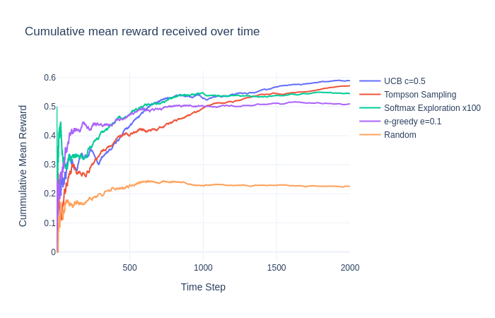
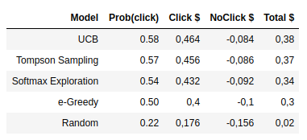

# Mult-armed Bandits

In probability theory, the multi-armed bandit problem (sometimes called the K-[1] or N-armed bandit problem[2]) is a problem in which a fixed limited set of resources must be allocated between competing (alternative) choices in a way that maximizes their expected gain, when each choice's properties are only partially known at the time of allocation, and may become better understood as time passes or by allocating resources to the choice.[3][4] This is a classic reinforcement learning problem that exemplifies the exploration-exploitation tradeoff dilemma. The name comes from imagining a gambler at a row of slot machines (sometimes known as "one-armed bandits"), who has to decide which machines to play, how many times to play each machine and in which order to play them, and whether to continue with the current machine or try a different machine.[5] The multi-armed bandit problem also falls into the broad category of stochastic scheduling. - https://en.wikipedia.org/wiki/Multi-armed_bandit

## Code

Multi-armed-Bandits.ipynb

## Results

## Author

Marlesson Santana